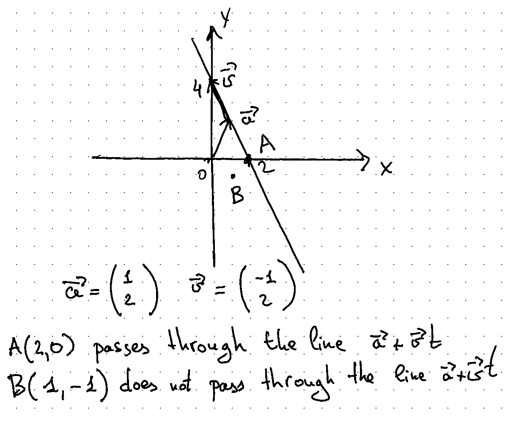

# Parametric equation of a line

## Exercise 1

You are given a point on a plane $P(p_x, p_y)$ and a line defined by a parametric equation:

$$
\vec{a} + t\vec{v} = \begin{pmatrix}
a_x + tv_x\\
a_y + tv_y
\end{pmatrix}.
$$

Assume $t \in \mathbb{R}$.

Derive and write a condition in a form of an equation for a line passing through a point.

> Hint: The equation must not contain $t$. It must contain $p_x, p_y, a_x, a_y, v_x, v_y$ parameters only.

### Example

## Exercise 2

Write a program that, given three points $A(x_a, y_a)$, $B(x_b, y_b)$ and $C(x_c, y_c$) as an input,
calculates if the line $AB$ is passing through the point $C$.

You must use the formula from the exercise 1.

The calculations must be implemented in a function (or a method). You must provide unit tests for the function.
